# WWW tuần 5

## Entity Relationship Diagram
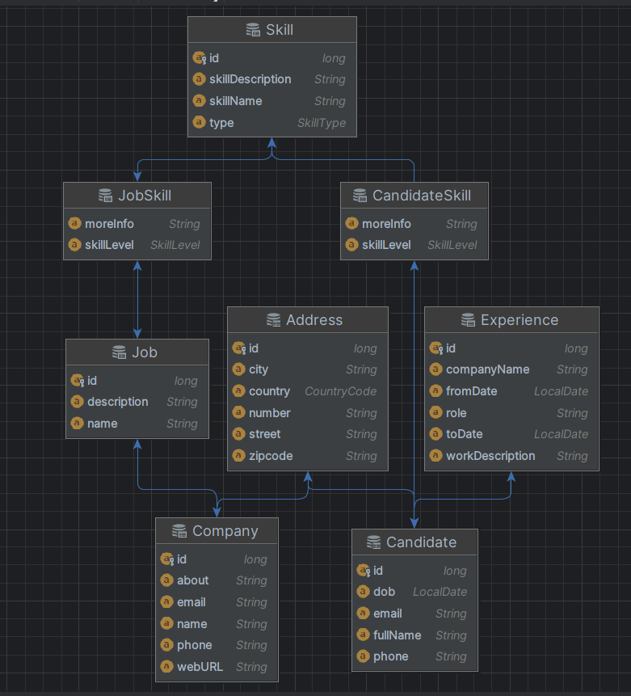

## Các chức năng
- Hiển thị danh sách công ty (companies).
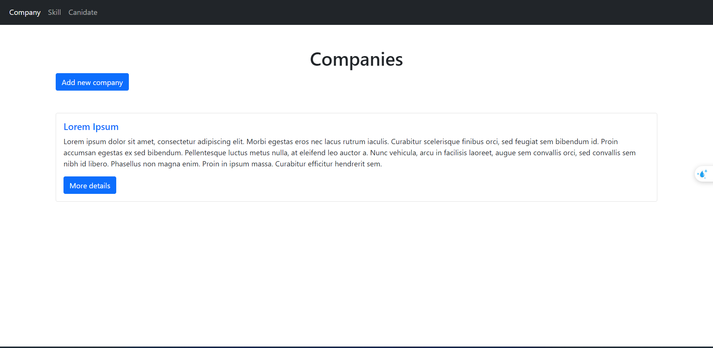
- Thêm công ty (add company).
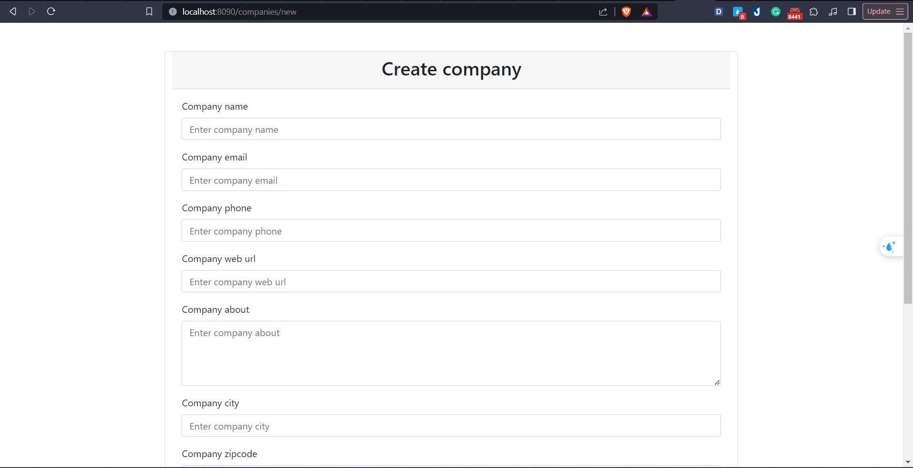
- Hiển thị chi tiết công ty (company detail).
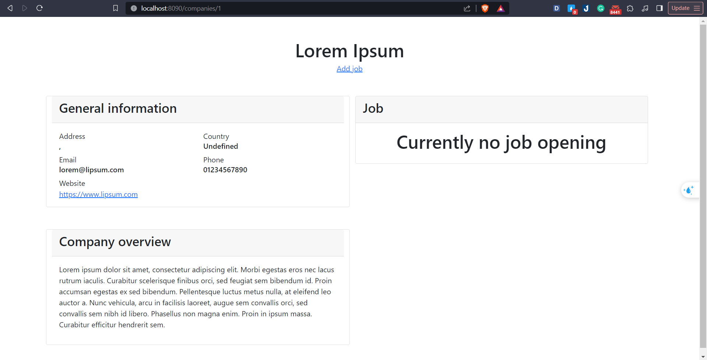
- Thêm công việc (add job).
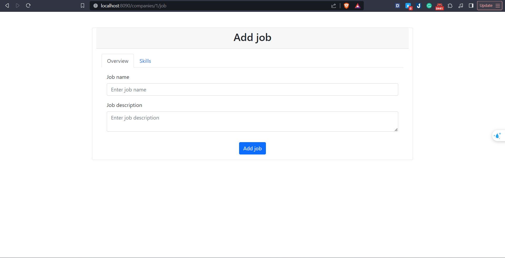
- Hiển thị danh sách kỹ năng (skills)
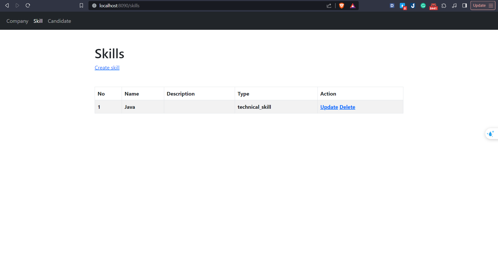
- Thêm kỹ năng (add skill)
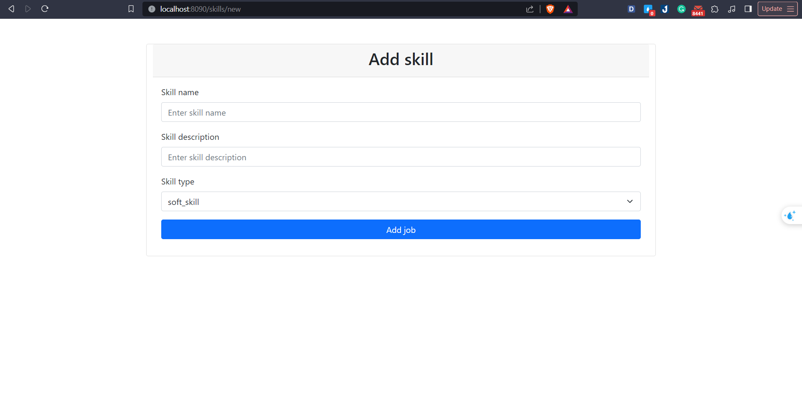
- Xóa kỹ năng (delete skill)
- Hiển thị danh sách ứng cử viên (candidates)
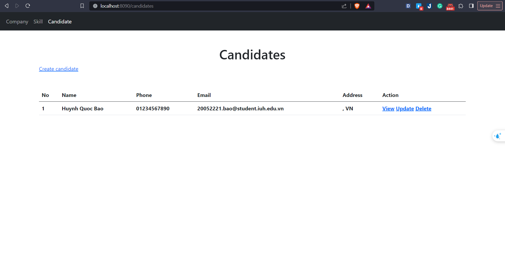
- Thêm ứng cử viên (add candidate)
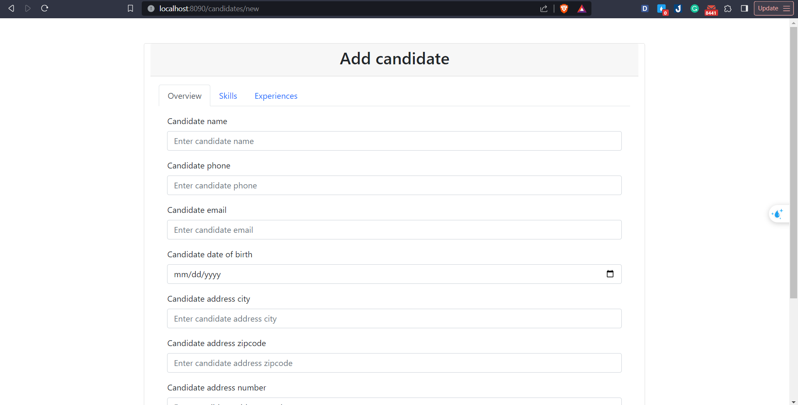
- Cập nhật ứng cử viên (update candidate)
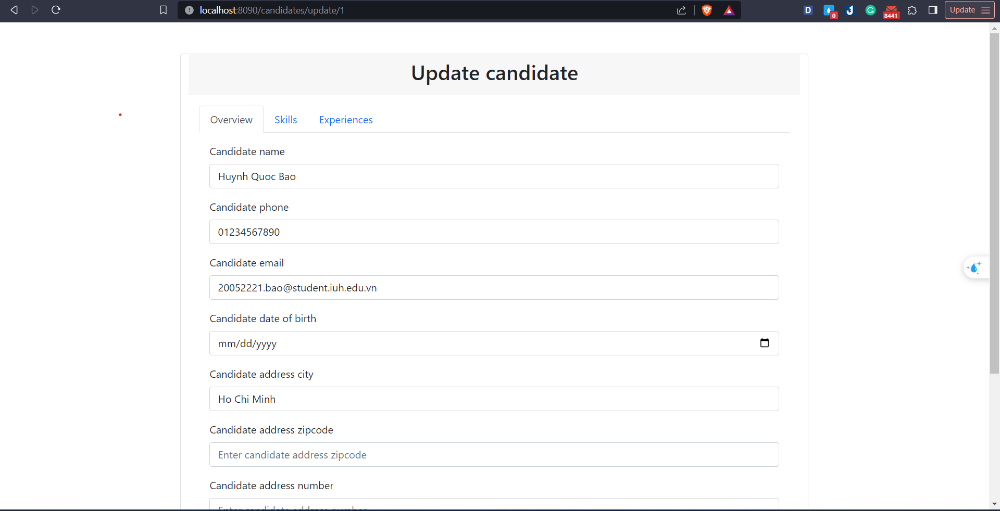
- Xóa ứng cử viên (delete candidate)
- Hiển thị danh sách công việc
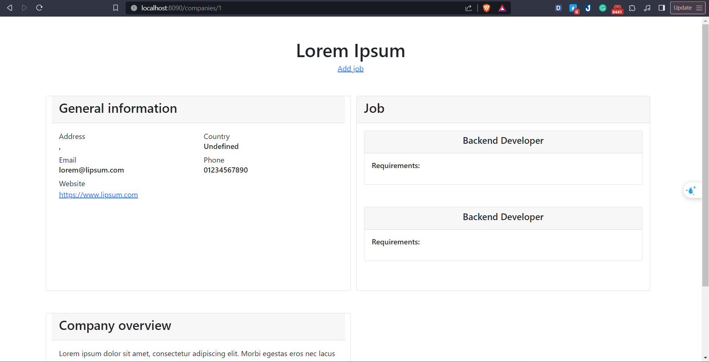
